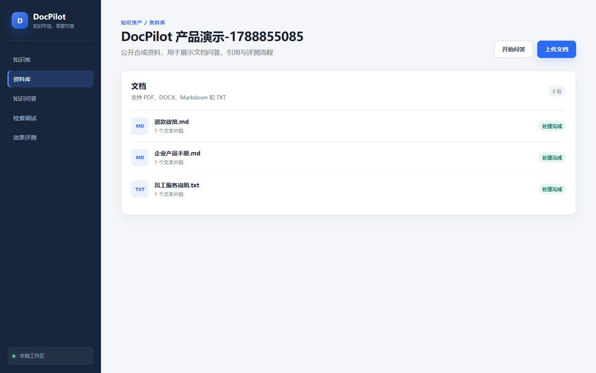
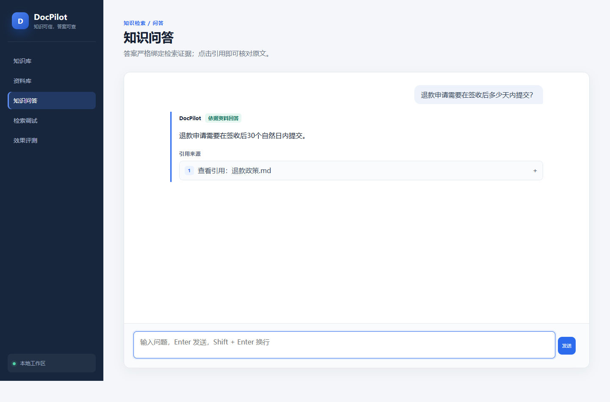
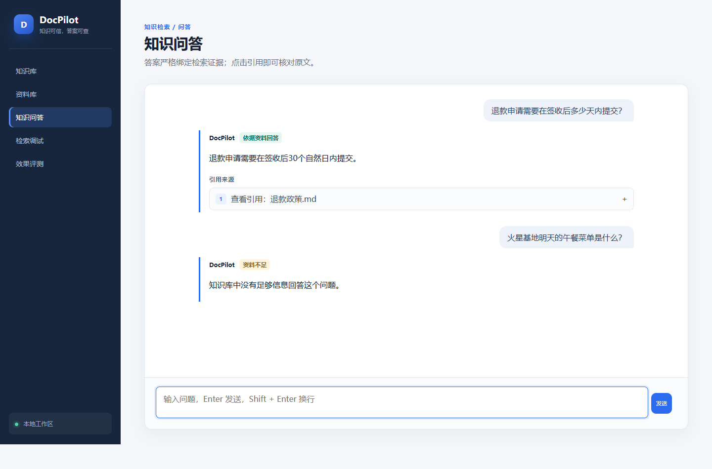
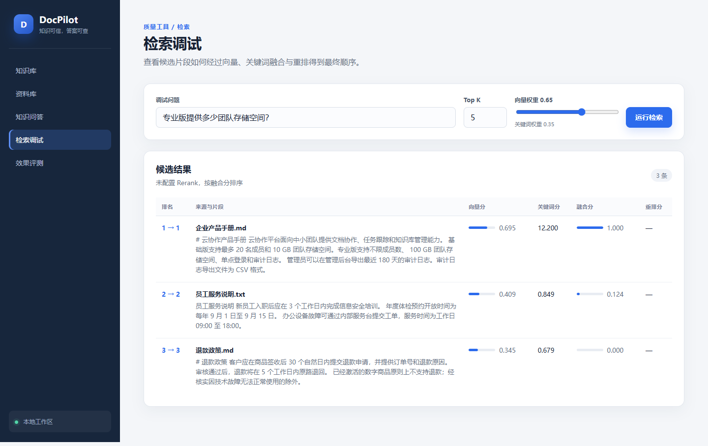
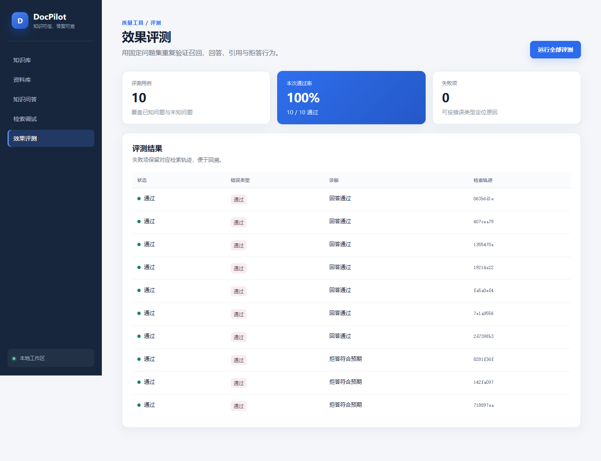

# DocPilot

DocPilot 是一个独立实现的企业文档问答与检索评测 MVP。它把“上传文件、建立索引、混合检索、回答引用、未知问题拒答、检索调试、批量评测”做成一条可运行、可解释的产品链路。

> 当前状态：Docker、真实百炼 Chat/Embedding、引用回答、资料不足拒答和十条演示评测均已验证。Rerank 因未配置百炼 Workspace ID，未纳入本次实测。

## 解决的问题

团队资料分散时，普通搜索难以跨文件定位答案，通用大模型又可能脱离资料补充事实。DocPilot 的核心取舍是：回答必须能回到原文；证据不足时明确拒答；检索排序需要可观察，而不是只展示最终一句话。

## 产品流程

`创建知识库 → 上传文档 → 解析切片 → Embedding → Qdrant → 向量 + BM25 → 可选 Rerank → 阈值判断 → 引用回答 / 固定拒答 → 评测`

## 核心功能

- 知识库与文档状态管理，失败任务可重试；
- TXT、Markdown、DOCX、文本型 PDF 解析与确定性切片；
- 阿里云百炼 `text-embedding-v4`，每批不超过 10 条；
- Qdrant 向量召回与 BM25 关键词召回，加权融合并保留分数；
- 可选 `qwen3-rerank`，展示初排、终排和名次变化；
- `qwen-plus` 结构化回答，引用 ID 经过后端白名单校验；
- 资料不足时返回固定拒答，不让模型自由补充；
- 评测用例、批量运行、失败定位与六类错误标签；
- 原创 React 管理界面：知识库、问答、检索调试、评测五个页面。

## 快速启动

要求：Docker Desktop 使用 Linux/WSL 2 引擎。

```powershell
Copy-Item .env.example .env
# 打开 .env，只填写你自己的 BAILIAN_API_KEY；如需 Rerank，再填写 BAILIAN_WORKSPACE_ID
docker desktop start
docker compose up --build -d
```

打开：

- 产品界面：http://127.0.0.1:3000
- API 文档：http://127.0.0.1:8000/docs
- Qdrant：http://127.0.0.1:6333/dashboard

停止服务（保留数据）：

```powershell
docker compose down
```

不要使用 `docker compose down -v`，除非明确要删除本地数据库和向量数据。

## 环境变量

| 变量 | 默认值 | 说明 |
|---|---|---|
| `BAILIAN_API_KEY` | 空 | 必填，仅写入本地 `.env` |
| `BAILIAN_BASE_URL` | DashScope OpenAI 兼容地址 | Chat 与 Embedding API Base |
| `BAILIAN_WORKSPACE_ID` | 空 | 可选；提供后启用 Rerank |
| `CHAT_MODEL` | `qwen-plus` | 回答模型 |
| `EMBEDDING_MODEL` | `text-embedding-v4` | 1024 维向量模型 |
| `RERANK_MODEL` | `qwen3-rerank` | 重排模型 |

Compose 会在容器内固定 SQLite、上传目录和 Qdrant 服务地址，避免把宿主机路径写进镜像。

## 测试

```powershell
cd backend
.\.venv\Scripts\python.exe -m pytest -v

cd ..\frontend
npm test -- --run
npm run build

cd ..
docker compose config
powershell -ExecutionPolicy Bypass -File scripts/smoke.ps1
```

2026-09-08 的自动化实测为后端 45/45、前端 5/5、生产构建通过。真实 Provider 验收状态见 [docs/testing.md](docs/testing.md)。

## 产品截图

| 知识库与文档状态 | 带引用回答 |
|---|---|
|  |  |

| 资料不足拒答 | 检索调试 |
|---|---|
|  |  |



## 架构与检索设计

完整数据流和组件边界见 [docs/architecture.md](docs/architecture.md)。产品保留向量原始分、关键词分、融合分、Rerank 分、初始名次和最终名次，调试页可直接解释候选片段为什么被排到前面。

## 产品决策

- 使用前后端分离单体，而不是微服务，控制个人项目复杂度；
- 使用 SQLite 管理业务状态、Qdrant 管理向量，各自职责清晰；
- 外部能力使用 Provider 接口，自动化测试无需真实 Key；
- 文档处理为显式动作，失败状态和错误原因对用户可见；
- 引用在后端校验，前端不直接信任模型生成的来源编号；
- Rerank 未配置时明确返回 `not_configured`，不伪装成已执行。

## 参考披露与个人实现边界

项目调研参考了 Kotaemon 等开源知识库产品的通用工作流，但 DocPilot 没有 Fork、复制或重命名其源码，也没有复用其品牌、文案和页面设计。需求范围、数据模型、API、RAG 编排、评测规则、界面和测试均在本仓库独立实现。

该仓库能够证明个人项目中的产品设计、流程拆解、AI 应用搭建、测试与问题排查能力；它不代表商业上线、真实用户规模、团队管理或生产环境运维经验。

## 已知限制

- 无登录、多租户和权限系统；
- PDF 仅支持文本层，不含 OCR；
- 文档处理为同步执行，不适合大批量文件；
- 默认中文分词采用轻量字符策略，未引入领域词典；
- 未配置百炼 Workspace ID 时不执行 Rerank；
- 当前只提供本地 Docker 演示，没有公开在线服务。

## 路线图

1. 配置百炼 Workspace ID 后实测 Rerank，并记录初排与重排差异；
2. 基于更多失败用例调整分词、融合权重和拒答阈值；
3. 将文档处理迁移为后台任务并增加进度；
4. 在有真实使用场景后再评估权限和在线部署。

## License

[MIT](LICENSE)
