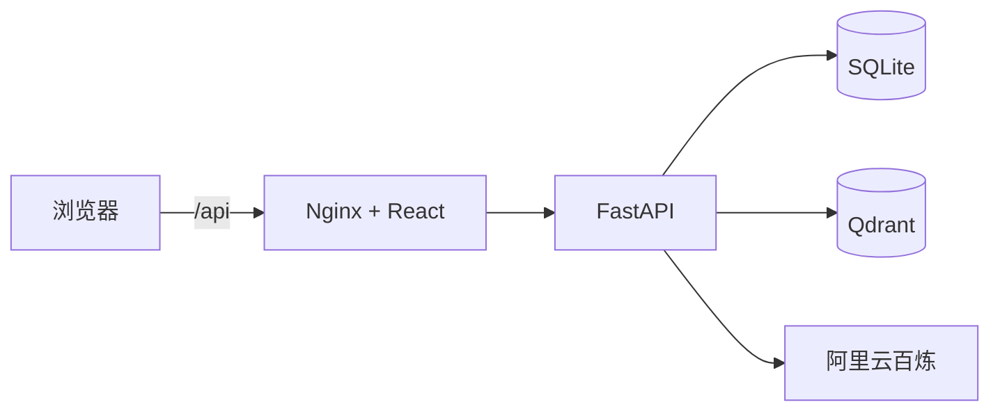
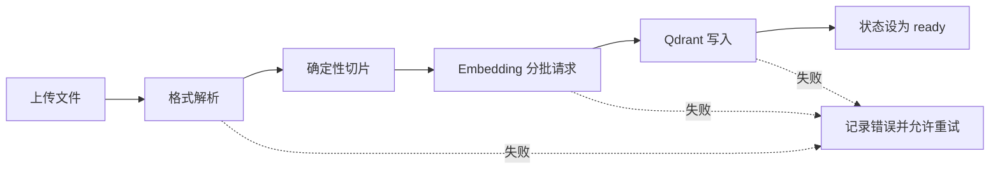
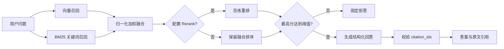

# DocPilot 架构说明

## 系统边界

DocPilot 是一个前后端分离的单体产品。React 负责交互，FastAPI 编排知识库流程，SQLite 保存业务数据，Qdrant 保存向量。模型能力通过 Provider 接口隔离，测试环境使用固定响应替身，运行环境使用阿里云百炼。

## 文档处理链路

- 支持 TXT、Markdown、DOCX 和文本型 PDF，不包含 OCR。
- Embedding 每批最多 10 段，结果按输入顺序写回。
- 只有向量全部写入成功后，文档状态才会变为 `ready`。
- 重试会先清理旧切片和旧向量，避免脏数据重复。

## 检索与回答链路

默认融合权重为向量 `0.65`、关键词 `0.35`。回答层只接受本轮检索上下文中的切片 ID；模型返回未知 ID、空答案或无有效引用时，产品统一转为资料不足。

## 数据与部署

- `docpilot_sqlite`：SQLite 数据库和上传文件。
- `docpilot_qdrant`：Qdrant 向量数据。
- 容器只绑定本机回环地址，默认不对局域网开放。
- `.env` 不进入 Git；公开仓库只保留无密钥的 `.env.example`。
